# Planet fitness and baskin robbins search

## Introduction
In Terre Haute, Indiana there are only two Baskin Robbins. Across the street from one baskin robbins is a planet fitness. Across the street from the other Baskin Robbins is Anytime Fitness. It seems unlikely that this is a coincidence that the only two Baskin Robbins happen to be across the street from gyms. This is a writeup investigating whether this trend continues when considering a large geographical area.

![baskin robbins in terre haute][thaute_br]
![planet fitness in terre haute][thaute_pf]

[thaute_br]: ./imgs/thaute_br.png
[thaute_pf]: ./imgs/thaute_pf.png

## Methods

I need to aquire the longitutude and latitude for all the stores for both Planet Fitness and Baskin Robbins. It is unlikely such information is available on their website, although there might be a list of store addresses. If I can find a list of addresses for all the stores then the google maps geolocator api can be used to turn addresses into longitude, latitude pairs. Alternatively I may be able to scrape the data off their map tracker pages.

### Finding planet fitness location data

My first approach is to check the planet fitness and baskin robbins websites to try to see if they have a list of stores.

First I checked planet fitness. On their website pressing "Find a Club" links to https://www.planetfitness.com/gyms .

![planet fitness gym locator][pf_gymlocator]

[pf_gymlocator]: ./imgs/pf-website-gymlocator.png

There is a map element in the page which shows all the gym locations. From previous experience I know that to do this usually a list of store long,lat pairs are retrieved from some private API. This leads me to the suspicion that I should check the network traffic that the browser is emitting to see if i can find the api and replicate the call. Alternatively I can try to find those values after they are loaded in memory. Either way, checking the network traffic first is a good first step.

I open the chrome dev tools using ctrl + shit + i 


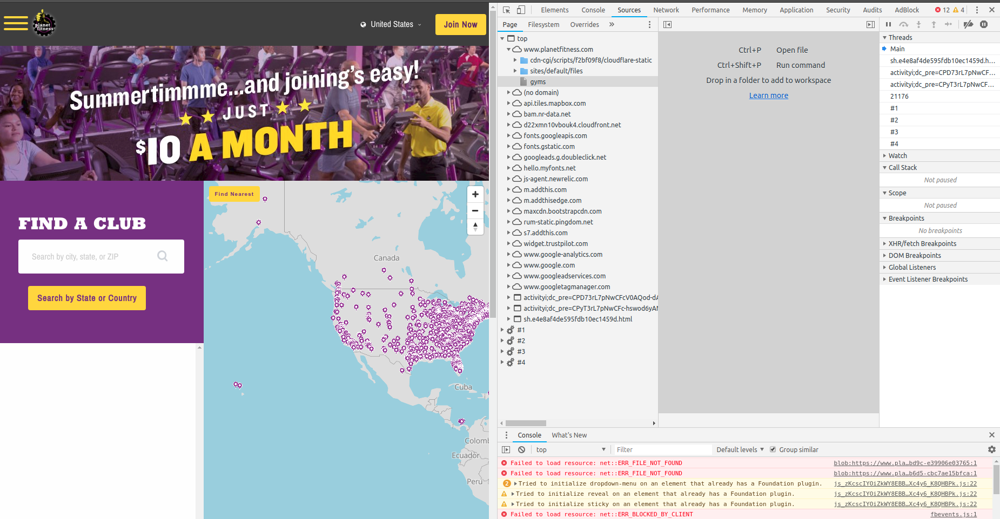

Clicking on the "Networking tab" shows the API calls that have been made

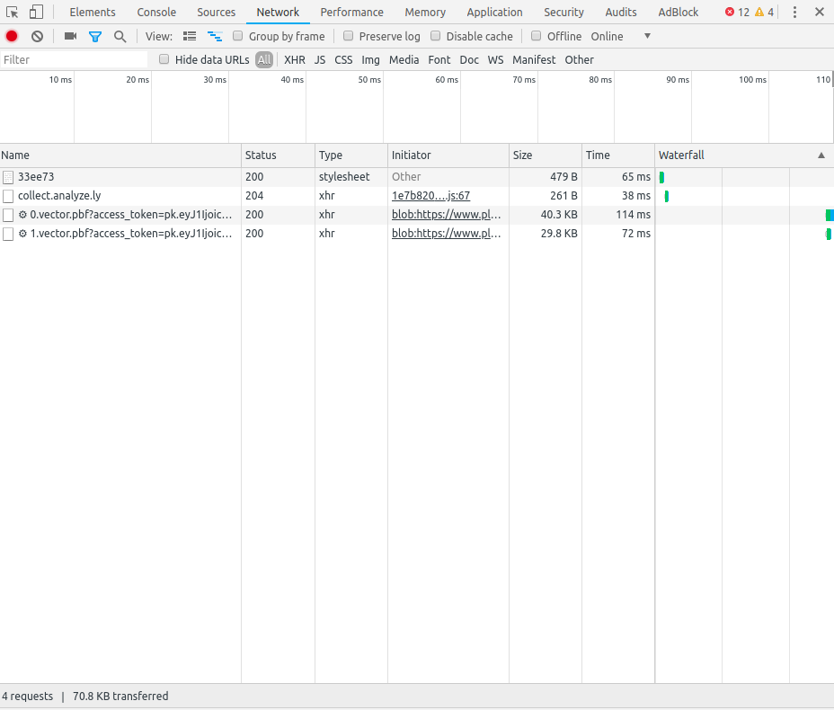

This shows only 4 requests made by the browser, but really there are many more that are made when the website is first loaded. Pressing the refresh button on the top of the browser will retrigger the window to load and then you can see 106 requests were made. 


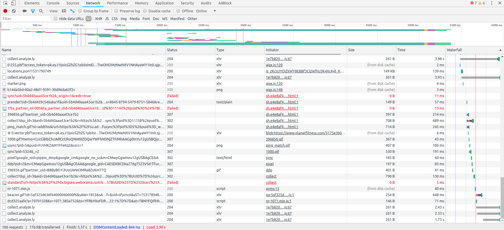

Note that under size some say "from disk cache". This is because some of the resources were already loaded since I've accessed the website before.

Now we can sort by type to try to find a request which had a type like json or xml since these are common formats to transmit data in. Hopefully the data is not in a proprietary format or encrypted since that would make it much harder to retrieve.


Before I attempt that though, I notice "marker.png" was loaded. The initator column can be used to track where that asset was requested from. 

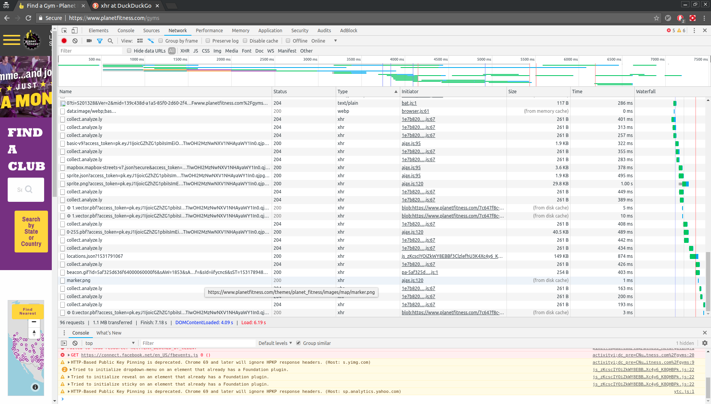

The initator shows that marker.png was loaded by "ajax.js:120"  which. Hovering over this initator shows the call stack.


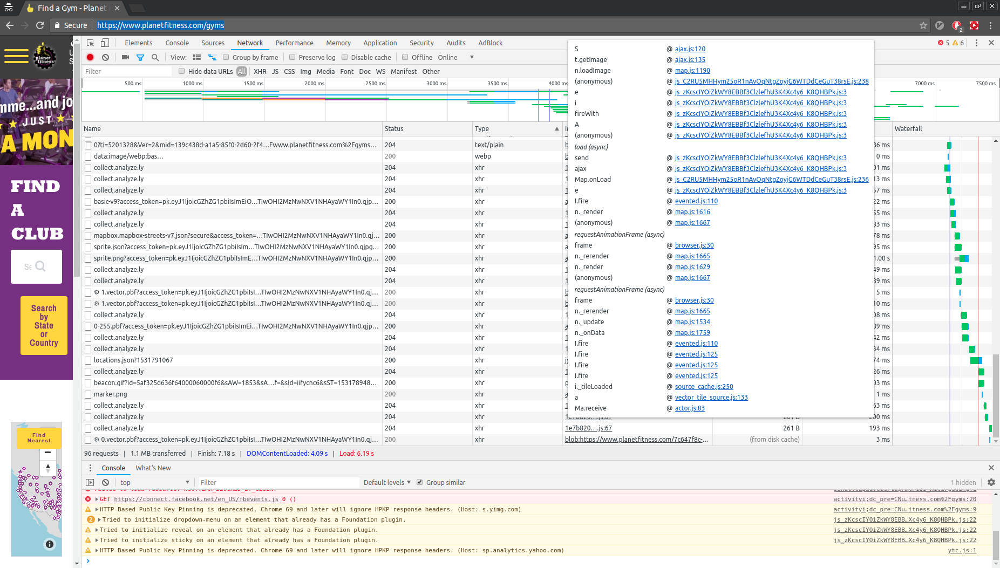

Looking down the callstack from top to bottom first I notice "fireWith" which is a jQuery comment. The dev tools shows that "fireWith" was loaded by "js_zKcscIYOiZkWY8EBBf3ClzlefhU3K4Xc4y6_K8QHBPk.js". Clicking on this link then scrolling to the top shows that this is indeed jquery.

https://www.planetfitness.com/sites/default/files/js/js_zKcscIYOiZkWY8EBBf3ClzlefhU3K4Xc4y6_K8QHBPk.js:formatted

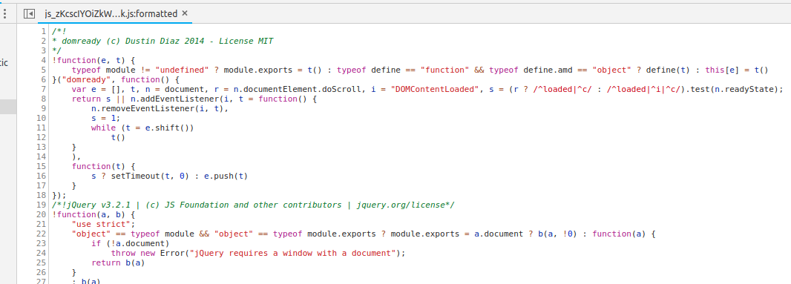

Now continuing to look down the call stack for marker.png I notice Map.onLoad which seems likely to be the initialization function for the map. This is likely around the chunk of code which initializes the store locations.

Map.onLoad is called by a seperate file "js_C2RU5MHHym25oR1nAvOqNtgZoyjG6WTDdCeGuT38rsE.js". Clicking on this link in the dev tools opens the file.
I've included the file in the "evidence-files". The call stack opens to the file on this line

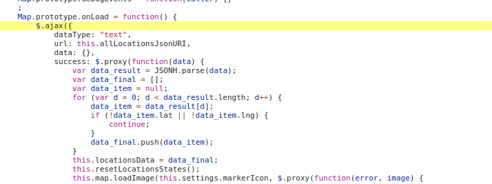

In this file they are setting the "onLoad" prototype for "Map" which will determine how "Map"s are constructed. The first thing this function does is use jquery.ajax ($ is a shortcut for jquery) to send a request for data. The request specifies the datatype, url, data for the request and the callback to perform when the data is successfully returned. In this case I notice that data is set to "{}" so there is not information being sent in the reuqest. Additionally on line 2230 we see the url is set to a variable "this.allLocationsJsonURI"

Using ctrl + F to search for this variable initilization I find where it's defined.

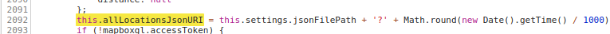

I've included the line 2092 below for clarity.

```js
this.allLocationsJsonURI = this.settings.jsonFilePath + '?' + Math.round(new Date().getTime() / 1000);
```

We see that this URI is set by "this.settings.jsonFilePath"

Again doing ctrl + f search we find in line 2086 that settings is set equal to another object.
```js
this.settings = drupalSettings.mapboxBlock.custom;
```

Using ctrl + f again to try to find where drupalSettings is defined I find only the following three references starting at line 2996

```js
Map.prototype.getLocationLocale = function(location) {
        var locale = null;
        var locale_languages = Object.keys(location.locales);
        if (locale_languages.length > 1 && drupalSettings.path.currentLanguage) {
            if (location.locales.hasOwnProperty(drupalSettings.path.currentLanguage)) {
                locale = location.locales[drupalSettings.path.currentLanguage];
            }
        }
        if (locale === null) {
            var locale_key = locale_languages[0];
            locale = location.locales[locale_key];
        }
        return locale;
    }
```

Using top -> search all files in dev tools all the first loaded by the browser for this web page can be searched. I did that and found nothing besides what I found around.
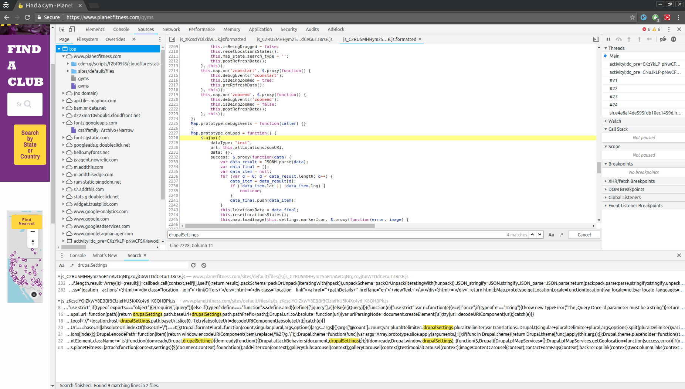


I wasn't able to find anything for drupalSettings in the Files, so maybe it just happens to be loaded in memory? 

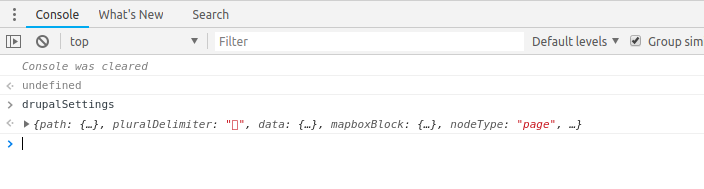

Using the arrow the object can be expanded and it's state inspected. Note that we were trying to find the value of 
```js
drupalSettings.mapboxBlock.custom.jsonFilePath
```

Sure enough we find all the information we were looking for.

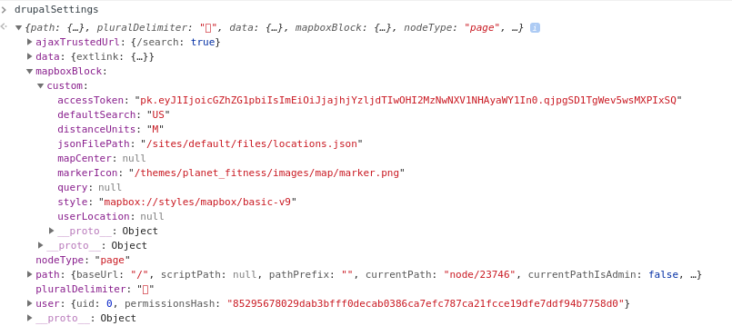

We find that the value of jsonFilePath is "/sites/default/files/locations.json"

Therefore if we navigate to the following website we should find the locations in json form.

https://www.planetfitness.com/sites/default/files/locations.json

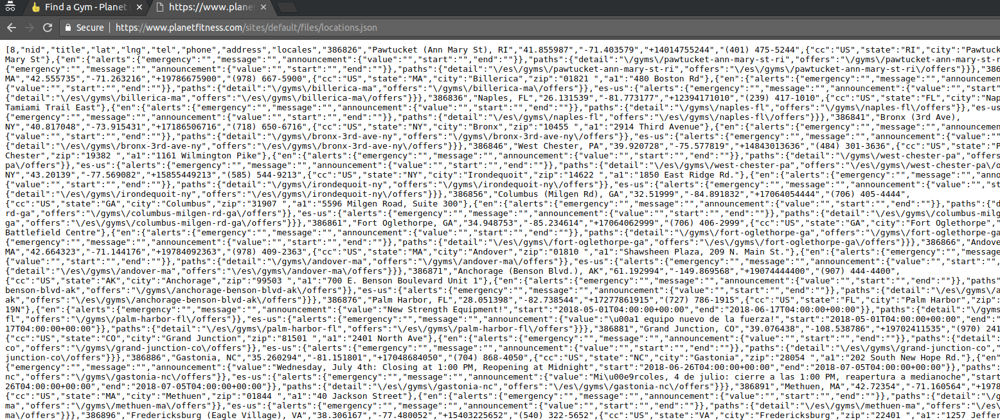

That's exactly what we found! Now that we have the json file we must parse it. 

### Analyzing planet fitness json format

Below I use jsonprettify.com to make the json more readable.

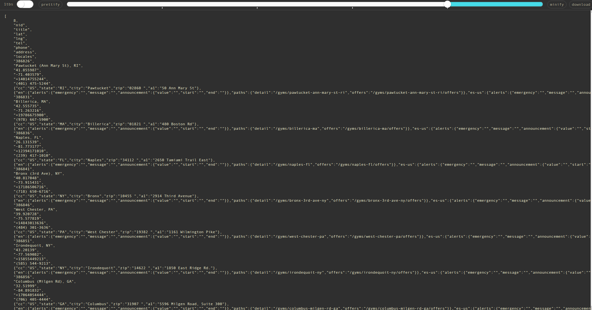

The entire object represented by locations.json is a flat array. I've truncated the output and put it in the markdown below for reference. The first object in the array is 8 and I'm not sure what that means. The next 9 objects in the array are clearly header fields such as "title". We see "lat" and "lng" as fields 3 and 4 which is perfect because that's what we were looking for. After that there are repeating groups of 8 entries in the array which correspond to the header fields. This should be able to be parsed in a simple loop.

```json
[
    8,
    "nid",
    "title",
    "lat",
    "lng",
    "tel",
    "phone",
    "address",
    "locales",
    "386826",
    "Pawtucket (Ann Mary St), RI",
    "41.855987",
    "-71.403579",
    "+14014755244",
    "(401) 475-5244",
    {"cc":"US","state":"RI","city":"Pawtucket","zip":"02860 ","a1":"50 Ann Mary St"},
    {"en":{"alerts":{"emergency":"","message":"","announcement":{"value":"","start":"","end":""}},"paths":{"detail":"/gyms/pawtucket-ann-mary-st-ri","offers":"/gyms/pawtucket-ann-mary-st-ri/offers"}},"es-us":{"alerts":{"emergency":"","message":"","announcement":{"value":"","start":"","end":""}},"paths":{"detail":"/es/gyms/pawtucket-ann-mary-st-ri","offers":"/es/gyms/pawtucket-ann-mary-st-ri/offers"}}},
    "386831",
    "Billerica, MA",
    "42.555735",
    "-71.263216",
    "+19786675900",
    "(978) 667-5900",
    {"cc":"US","state":"MA","city":"Billerica","zip":"01821 ","a1":"480 Boston Rd"},
    {"en":{"alerts":{"emergency":"","message":"","announcement":{"value":"","start":"","end":""}},"paths":{"detail":"/gyms/billerica-ma","offers":"/gyms/billerica-ma/offers"}},"es-us":{"alerts":{"emergency":"","message":"","announcement":{"value":"","start":"","end":""}},"paths":{"detail":"/es/gyms/billerica-ma","offers":"/es/gyms/billerica-ma/offers"}}},
    "386836"
]
```
I created the script parse-pf.py below to iterate through the json keys and convert the data into a structure that I could more easily manipulate.
I chose to read the data into a pandas dataframe.

```python
import json
import pandas as pd

with open("evidence-files/pf-locations.json","r") as read_file:
    data = json.load(read_file)
    obj_limit = int((len(data)-9)/8)
    idx = 9 #keys start at index 9
    d = []
    for x in range(obj_limit):
        row = {'nid': data[idx],'title': data[idx+1],
         'lat': data[idx+2], 'lng': data[idx+3],
         'tel': data[idx+4], 'phone': data[idx+5],
         'address': data[idx+6], 'locales': data[idx+7]}
        d.append(row)
        idx = idx + 8 # skip to next group of 8 keys
    print(pd.DataFrame(d)[['title','lat','lng']])
```
You can see the output of the script below. I was able to successfully retrieve the locations of 1652 planet fitness!

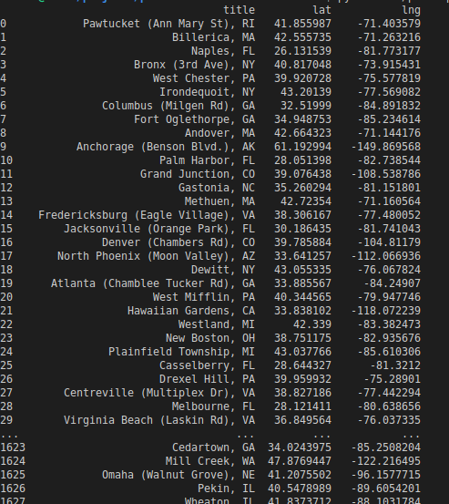


### Finding Baskin Robbins location data
TODO

### Analyzing Baskin Robbins location data
TODO

### Calculate clustering of Planet Fitness and Baskin Robbins geographically
TODO